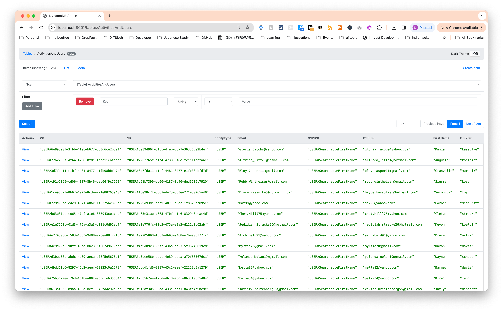
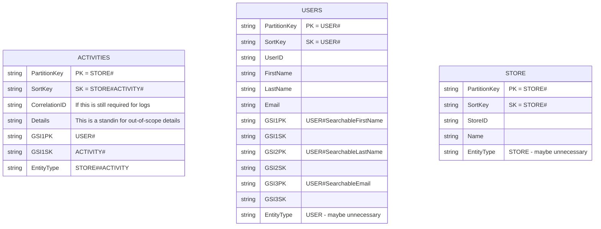

# Spike DynamoDB Search

This spike looks at how to "normalize" user information to potentially search through an activity feed without so much duplication.

tl;dr DynamoDB is not good if you need to filter/partial search anything if you also need pagination. You would need to stick with `Denormalize + duplicate`.

## How to run the spike

I opted to use [LocalStack](https://www.localstack.cloud/) for the spike with `aws-cdk` to attempt to keep it minimal. This means that you will need to run.

### Prerequisites

- Docker (used for `docker compose`).
- Node 20.
- PNPM

## Running the spike

Run a bash bootstrap script to set up LocalStack, DynamoDB admin, deploy the AWS CDK locally (very limited capabilities but useful) and seed the data.

```bash
# Run the bootstrap script
$ pnpm bootstrap
```

Once the data it bootstrapped and Docker compose is up, you can head to `localhost:8001` to see the data.


Open the `ActivitiesAndUsers` table and find a user with a name you want to match. The generated seeds will gift you some matching activities for those users.



In `main.ts` update `SEARCH_FIRST_NAME` to have a search term you wish to use. It should match `begins_with` since there is not really a contains option.

You can then run `pnpm start` and it will return any matching users and in turns any matching activities.

```bash
$ pn start

> spike-dynamodb-search@1.0.0 start /Users/dennis.okeeffe/code/okeeffed/spike-dynamodb-search
> tsx --env-file=.env.local main.ts

[
  {
    EntityType: 'USER',
    Email: 'Candido9@gmail.com',
    GSI1PK: 'USER#SearchableFirstName',
    GSI3SK: 'candido9@gmail.com',
    FirstName: 'Carey',
    GSI2SK: 'champlin',
    GSI1SK: 'carey',
    SK: 'USER#27f41ee3-a602-40db-b76c-d70831c5f28f',
    GSI3PK: 'USER#SearchableEmail',
    PK: 'USER#27f41ee3-a602-40db-b76c-d70831c5f28f',
    LastName: 'Champlin',
    GSI2PK: 'USER#SearchableLastName'
  },
  {
    EntityType: 'USER',
    Email: 'Anahi44@hotmail.com',
    GSI1PK: 'USER#SearchableFirstName',
    GSI3SK: 'anahi44@hotmail.com',
    FirstName: 'Chelsea',
    GSI2SK: 'casper',
    GSI1SK: 'chelsea',
    SK: 'USER#c4080672-15ec-42a1-bc73-690d67fb5d9b',
    GSI3PK: 'USER#SearchableEmail',
    PK: 'USER#c4080672-15ec-42a1-bc73-690d67fb5d9b',
    LastName: 'Casper',
    GSI2PK: 'USER#SearchableLastName'
  },
  {
    EntityType: 'USER',
    Email: 'Jefferey_Hegmann47@hotmail.com',
    GSI1PK: 'USER#SearchableFirstName',
    GSI3SK: 'jefferey_hegmann47@hotmail.com',
    FirstName: 'Chester',
    GSI2SK: 'dicki',
    GSI1SK: 'chester',
    SK: 'USER#f3e5af33-2fbb-4f86-bca9-331fefd14b85',
    GSI3PK: 'USER#SearchableEmail',
    PK: 'USER#f3e5af33-2fbb-4f86-bca9-331fefd14b85',
    LastName: 'Dicki',
    GSI2PK: 'USER#SearchableLastName'
  },
  {
    EntityType: 'USER',
    Email: 'Chet.Hilll75@yahoo.com',
    GSI1PK: 'USER#SearchableFirstName',
    GSI3SK: 'chet.hilll75@yahoo.com',
    FirstName: 'Cletus',
    GSI2SK: 'stracke',
    GSI1SK: 'cletus',
    SK: 'USER#b63e31ae-c065-47bf-a1e6-830943ceac4d',
    GSI3PK: 'USER#SearchableEmail',
    PK: 'USER#b63e31ae-c065-47bf-a1e6-830943ceac4d',
    LastName: 'Stracke',
    GSI2PK: 'USER#SearchableLastName'
  },
  {
    EntityType: 'USER',
    Email: 'Dax98@yahoo.com',
    GSI1PK: 'USER#SearchableFirstName',
    GSI3SK: 'dax98@yahoo.com',
    FirstName: 'Corbin',
    GSI2SK: 'medhurst',
    GSI1SK: 'corbin',
    SK: 'USER#729d93de-edc9-4871-a8ac-1f8375ac895e',
    GSI3PK: 'USER#SearchableEmail',
    PK: 'USER#729d93de-edc9-4871-a8ac-1f8375ac895e',
    LastName: 'Medhurst',
    GSI2PK: 'USER#SearchableLastName'
  }
]
Searching with matching user IDs [
  'USER#27f41ee3-a602-40db-b76c-d70831c5f28f',
  'USER#c4080672-15ec-42a1-bc73-690d67fb5d9b',
  'USER#f3e5af33-2fbb-4f86-bca9-331fefd14b85',
  'USER#b63e31ae-c065-47bf-a1e6-830943ceac4d',
  'USER#729d93de-edc9-4871-a8ac-1f8375ac895e'
]
Filter expression GSI1PK IN (:userid1, :userid2, :userid3, :userid4, :userid5)
Expression attribute values {
  ':userid1': 'USER#27f41ee3-a602-40db-b76c-d70831c5f28f',
  ':userid2': 'USER#c4080672-15ec-42a1-bc73-690d67fb5d9b',
  ':userid3': 'USER#f3e5af33-2fbb-4f86-bca9-331fefd14b85',
  ':userid4': 'USER#b63e31ae-c065-47bf-a1e6-830943ceac4d',
  ':userid5': 'USER#729d93de-edc9-4871-a8ac-1f8375ac895e'
}
{
  TableName: 'ActivitiesAndUsers',
  KeyConditionExpression: 'PK = :pk AND begins_with(SK, :sk)',
  FilterExpression: 'GSI1PK IN (:userid1, :userid2, :userid3, :userid4, :userid5)',
  ExpressionAttributeValues: {
    ':pk': 'STORE#123',
    ':sk': 'STORE#123#ACTIVITY#',
    ':userid1': 'USER#27f41ee3-a602-40db-b76c-d70831c5f28f',
    ':userid2': 'USER#c4080672-15ec-42a1-bc73-690d67fb5d9b',
    ':userid3': 'USER#f3e5af33-2fbb-4f86-bca9-331fefd14b85',
    ':userid4': 'USER#b63e31ae-c065-47bf-a1e6-830943ceac4d',
    ':userid5': 'USER#729d93de-edc9-4871-a8ac-1f8375ac895e'
  },
}
[
  {
    EntityType: 'STORE#123#ACTIVITY',
    Details: 'Textor nostrum aureus.',
    GSI1PK: 'USER#27f41ee3-a602-40db-b76c-d70831c5f28f',
    GSI1SK: 'ACTIVITY#0049f0d4-dd1a-426a-9273-e14d02de86cb',
    SK: 'STORE#123#ACTIVITY#0049f0d4-dd1a-426a-9273-e14d02de86cb',
    PK: 'STORE#123',
    Timestamp: '2024-02-18T23:20:20.385Z'
  }
  // ... other matches
]
```

> Note: We assume in this example we have one store with ID `123`. I seeded it that way.

## Tear down

You'll want to run `docker compose down` when finished.

## The approach

I am keeping this simple, so you can think of the relationships like so:



The idea is that any given user can be searched upon, and then we can join that user onto any activities that they've been involved with.

## Design decisions

**The desired outcome:** I want to be able to search for user activities based on either their first name, last name and email with it being case-insensitive and also easy to paginate.

Please note that there are some _not so ideal_ limitations to performing something like search in this scenario.

There are some very concerning things that show up from The DynamoDB book:

- **Enforcing schema:** "The fact that DynamoDB (and other NoSQL databases) are schemaless does not mean that your data should not have a schema that way leads to madness. Rather, your record schema is enforced elsewhere, in your application code, rather than in your database." - I do not believe we approach our table like this.
- **Shortfalls of filter expressions:** "First, it reads items matching your Query or Scan from the database. Second, if a filter expression is present, it filters out items from the results that don’t match the filter expression. Third, it returns any remaining items to the client. You effectively need to rely heavily on **KeyConditionExpression**." - so we don't want to scan, but it is also impossible to search for multiple IDs at once (without filtering returned results) unless we want to make parallel requests (which come with its own problems e.g. pagination, too-many-requests throttling, etc.).
- You should use generic GSIs for naming (this enables you to re-use GSIs for different entities) but **we would still need a new GSI for every access pattern on a new entity** _unless_ you use local indexes, but they can only be made at table creation time (it is no longer an option). There is also only really a `begins_with` option for sort keys (but I am hoping that I am wrong here) when matching strings as opposed to something like "contains".

For something like our relationships which are one-to-many, you have the following choices:

| Strategy                        | Notes                                                                                                |
| ------------------------------- | ---------------------------------------------------------------------------------------------------- |
| Denormalize + complex attribute | Good when nested objects are bounded and are not accessed directly                                   |
| Denormalize + duplicate         | Good when duplicated data is immutable or infrequently changing                                      |
| Primary key + Query API         | Most common. Good for multiple access patterns both the parent and related entities.                 |
| Secondary index + Query API     | Similar to primary key strategy. Good when primary key is needed for something else.                 |
| Composite sort key              | Good for deeply nested hierarchies where you need to search through multiple levels of the hierarchy |

Right now, we do **denormalize + duplicate**, but in contrary to what it says above, our data is MUTABLE (as for how frequent it changes (name, email etc.), I guess we will find out).

This spike looks to apply best practices where possible to move towards the latter three approaches, but there is a painful trade-off:

1. If we stay denormalized, we maintain the ability to search using GSIs to get the appropriate records back straight away IF the data is not stale.
2. If we stay denormalized but use filter expressions instead of GSIs, we effectively have to grab all the data first, then filter it.
3. If we go with the composite key approach, we have to really lock down on our entities, but effectively it would mean our query is split into two parts: (1) searching and (2) resolving the data.

For point (3), if we design the table with normalization for the users, you would still need to resolve the data by fetching the data, then filtering (albeit it should be a significantly smaller data set to filter from depending on our primary key).

If you opted not to use the filter expression, you would have to parallelize requests which I think already means that option is in the bin.

On top of all of this, if you go for a filter expression, the `Limit` property **does not apply** to the filtered expression, but in fact the original data matching based on the `KeyConditionExpression`. Any pagination would need to actually happen on the client side.

These trade-offs in my opinion are all pretty rough, but doing so with correctly enforced GSIs _should be_ faster and significantly cheaper.

Sadly, the only way to really have your cake and eat it too for the pagination is to stick with `Denormalize + duplicate`.
